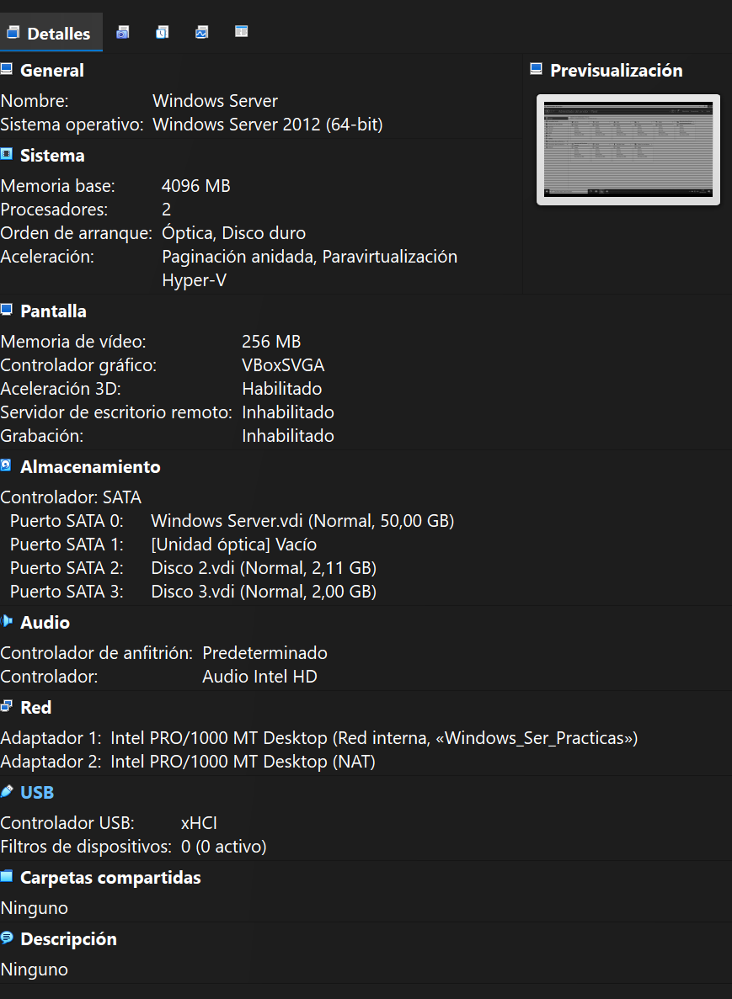
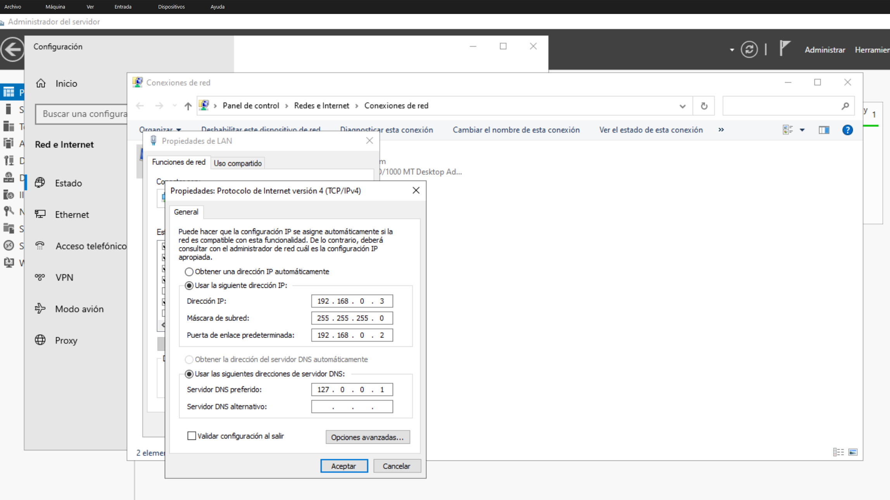
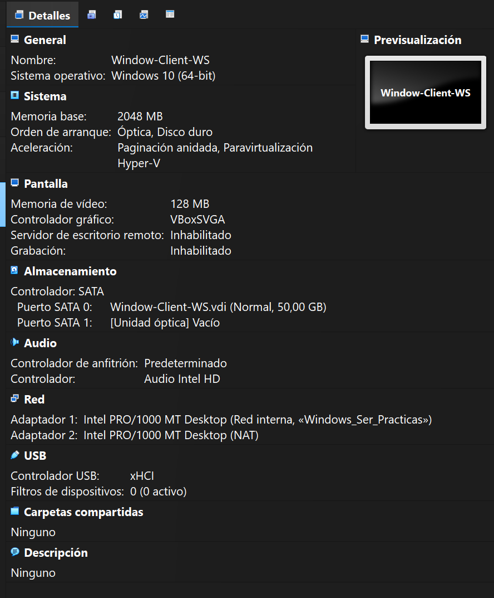
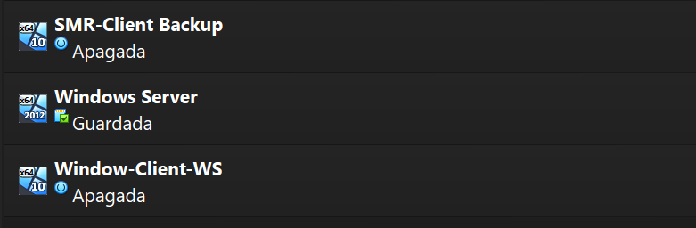
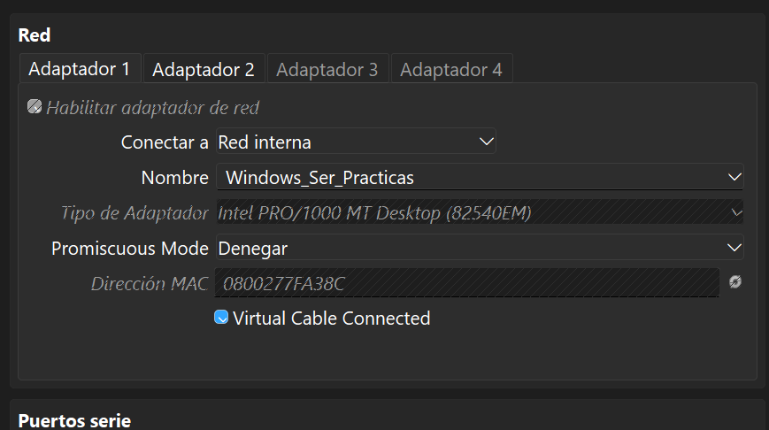

# Configuración de VirtualBox — Infraestructura del Laboratorio

Este documento recoge la configuración base de las máquinas virtuales que
forman parte del laboratorio de Windows Server 2022. Todo el entorno corre
sobre Oracle VM VirtualBox, con una red interna para la comunicación entre
las VMs y una interfaz NAT para la salida a Internet.

## Equipos del laboratorio

El laboratorio está compuesto por tres máquinas virtuales:

- Windows Server: Windows Server 2012 (64-bit), actúa como controlador de
  dominio (DC01). Tiene 4 GB de RAM, 2 procesadores y un disco de 50 GB.
- Window-Client-WS: Windows 10 (64-bit), es el cliente que se unirá al
  dominio (PC01). Cuenta con 2 GB de RAM y un disco de 50 GB.
- SMR-Client Backup: equipo adicional empleado como cliente de pruebas
  para los procesos de backup.

## Configuración de red

Cada máquina virtual dispone de dos adaptadores de red. El primero está
conectado a una red interna llamada "Windows_Ser_Practicas", que permite
la comunicación entre las VMs del laboratorio. El segundo adaptador está
en modo NAT y se utiliza exclusivamente para que las máquinas tengan
salida a Internet cuando sea necesario actualizar o descargar componentes.

## Capturas de la configuración

A continuación se incluyen las imágenes que documentan la configuración
del entorno paso a paso.

### Configuración del servidor (DC01)

Configuración general de la máquina virtual Windows Server. Se le asignaron
4 GB de RAM, 2 procesadores y 50 GB de disco. La aceleración de
paravirtualización está habilitada con la interfaz Hyper-V para mejorar
el rendimiento del equipo.

### Configuración de IP estática del servidor

Asignación de la dirección IP estática en el adaptador de red del
servidor. Esta configuración es necesaria para que el equipo pueda actuar
como controlador de dominio y servidor DNS dentro de la red del
laboratorio.

Los valores asignados fueron:

- Dirección IP: 192.168.0.3
- Máscara de subred: 255.255.255.0
- Puerta de enlace: 192.168.0.2
- Servidor DNS preferido: 127.0.0.1

El servidor DNS apunta a 127.0.0.1 porque este equipo será el encargado
de ofrecer el servicio DNS tras la promoción a controlador de dominio.

### Configuración del cliente (PC01)

Configuración general de la máquina virtual Window-Client-WS, basada en
Windows 10 de 64 bits. Dispone de 2 GB de RAM y un disco de 50 GB. Esta
máquina será unida al dominio del laboratorio en una fase posterior.

### Vista general de la plataforma

Captura del VirtualBox Manager con las tres máquinas virtuales del
laboratorio (SMR-Client Backup, Windows Server y Window-Client-WS),
mostrando su estado en el momento en que se tomó la imagen.

### Red del laboratorio

Configuración de los adaptadores de red de las máquinas virtuales. Cada
equipo dispone de un adaptador Intel PRO/1000 MT Desktop conectado a la
red interna "Windows_Ser_Practicas" y de un segundo adaptador en modo
NAT para el acceso a Internet.

## Resultado esperado

Con esta configuración base el laboratorio queda preparado para los
siguientes pasos: promocionar el equipo Windows Server a controlador de
dominio, unir el cliente Window-Client-WS al dominio creado, y comenzar
a desplegar los servicios y políticas que se documentan en las secciones
siguientes del repositorio.

## Navegación

[<- 01-Infraestructura](../) · [README principal](../../README.md)

