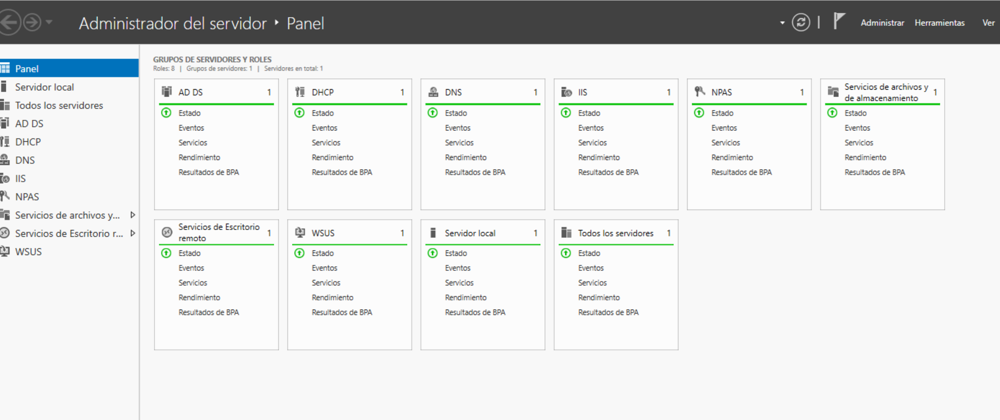
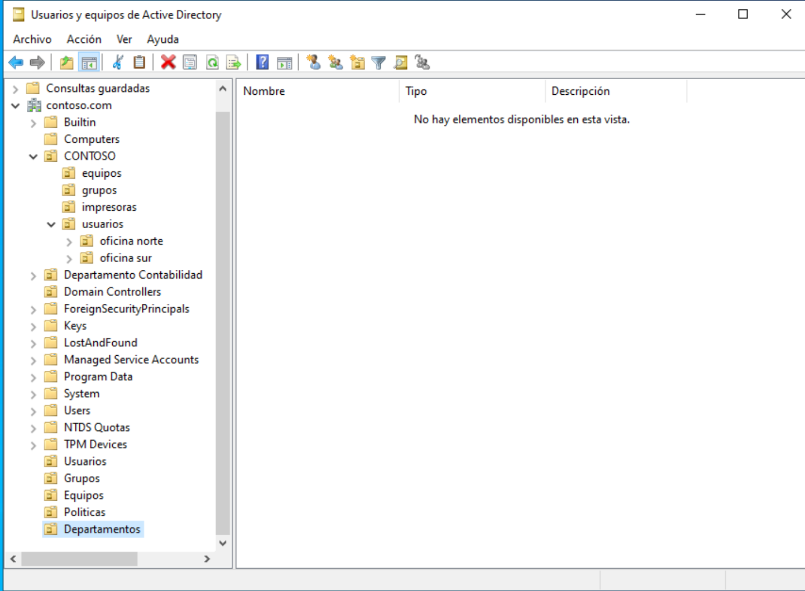
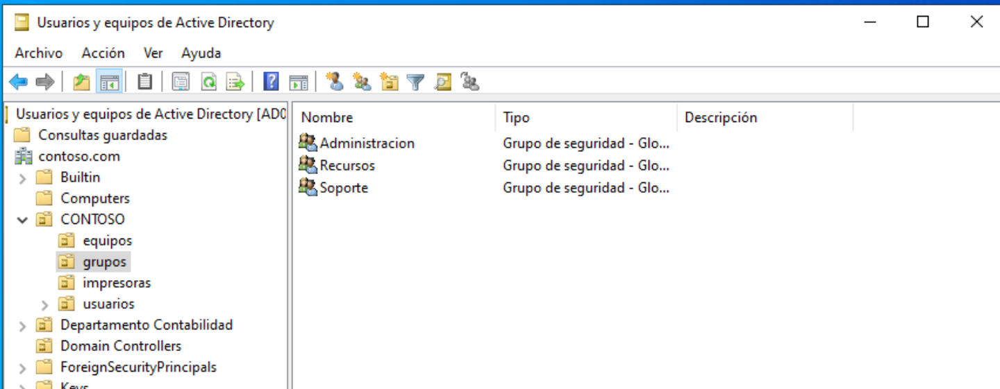
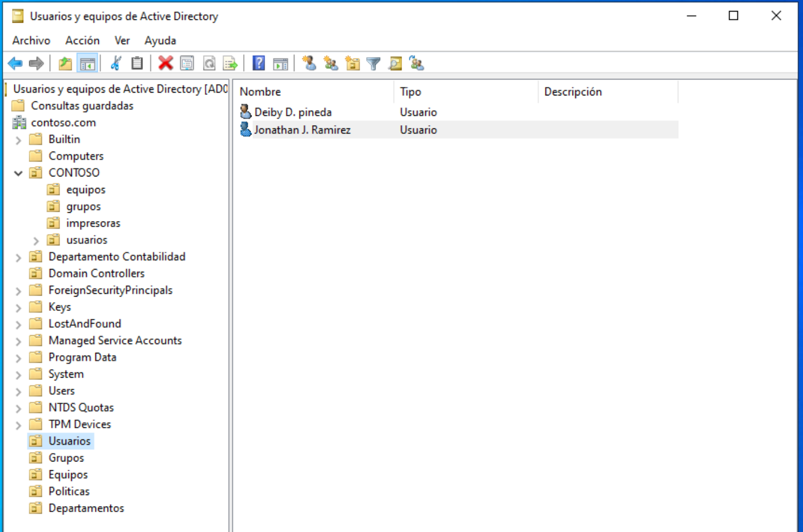
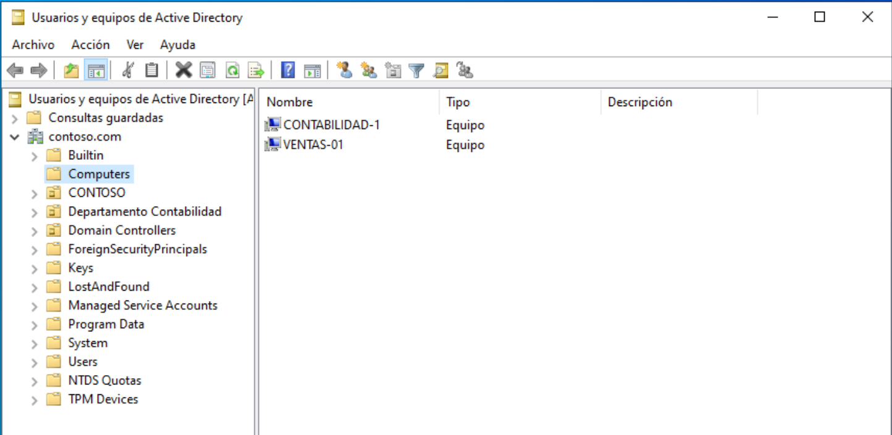
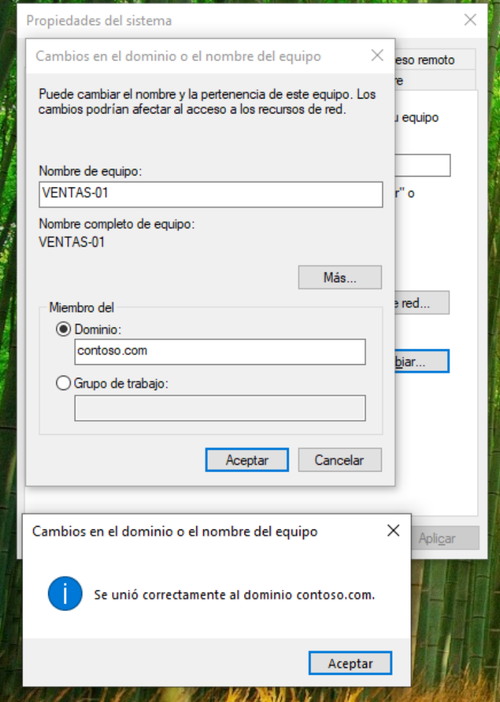
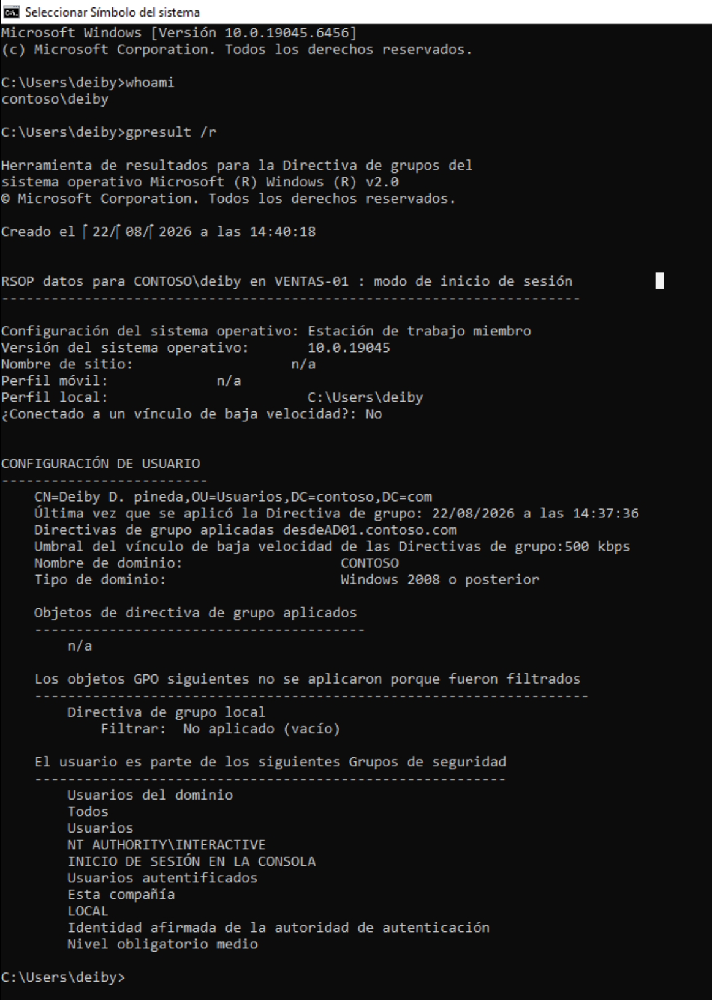

# Active Directory — contoso.com

Este apartado documenta el trabajo realizado sobre Active Directory en
el servidor DC01 del laboratorio. El dominio configurado es
contoso.com y la máquina servidor tiene la dirección IP 192.168.0.3,
con el servicio DNS apuntando a 127.0.0.1 tras la promoción a
controlador de dominio.

El objetivo de la sección es dejar constancia de la estructura de
unidades organizativas creadas, los grupos y usuarios dados de alta,
la unión de equipos al dominio y la verificación de que todo el
conjunto funciona correctamente desde el lado cliente.

## Estado del servidor

Antes de empezar a trabajar con Active Directory conviene tener claros
los roles instalados en el DC01, ya que condicionan qué servicios se
pueden levantar. En el servidor están activos AD DS, DHCP, DNS, IIS,
NDAS, los servicios de archivo y almacenamiento, los servicios de
Escritorio remoto y WSUS. Todos los análisis de BPA aparecen en
estado Listo en el momento de la captura, sin errores pendientes.

## Diseño de la estructura de OUs

La primera decisión de diseño fue definir la jerarquía de unidades
organizativas. Se optó por una estructura que refleja una organización
real, separando equipos, grupos, impresoras y usuarios, y añadiendo
dos OUs adicionales para representar delegaciones geográficas
(oficina norte y oficina sur).

La OU raíz utilizada como contenedor principal es CONTOSO, ubicada
dentro de contoso.com. Dentro de ella se ubicaron las siguientes OUs:

- equipos, destinada a las cuentas de máquina unidas al dominio.
- grupos, que agrupa los grupos de seguridad del dominio.
- impresoras, pensada para las cuentas de impresora publicadas.
- usuarios, donde se dieron de alta las cuentas de usuario. Dentro de
  esta OU se crearon además oficina norte y oficina sur como
  sub-OUs para representar delegaciones.

Esta separación permite aplicar GPOs de forma granular y delegar la
administración por áreas sin afectar al resto del dominio.

## Creación de grupos de seguridad

Dentro de la OU grupos se crearon tres grupos de seguridad globales:
Administracion, Recursos y Soporte. La idea es aplicar permisos
diferenciados sobre los recursos compartidos del dominio en función
del grupo al que pertenezca cada usuario.

Los grupos se crearon con ámbito global y tipo seguridad, que es la
combinación habitual cuando se van a utilizar para asignar permisos
sobre recursos del dominio y se quiere poder anidar usuarios de
cualquier OU dentro del dominio.

## Alta de usuarios

Los usuarios se dieron de alta desde la consola Usuarios y equipos de
Active Directory sobre la OU Users. En el laboratorio se crearon dos
cuentas de prueba: Deliby D. pineda y Jonathan J. Ramirez.

Las cuentas se configuraron con contraseña inicial y la opción de
cambio en el primer inicio de sesión, que es la práctica recomendada
en entornos de Active Directory para cuentas recién creadas.

## Unión de equipos al dominio

Para validar el correcto funcionamiento del controlador de dominio y
del servicio DNS, se unieron al dominio dos equipos clientes:
CONTABILIDAD-1 y VENTAS-01. Ambos aparecen dentro de la OU Computers
como cuentas de equipo gestionadas por el dominio.

El proceso de unión se realizó desde la ventana de Propiedades del
sistema, apartado Cambios en el dominio o el nombre del equipo. En
la captura se puede ver cómo VENTAS-01 se une al dominio contoso.com
y, tras pulsar Aceptar, el sistema muestra el mensaje "Se unió
correctamente al dominio contoso.com".

Este paso valida de forma práctica tres cosas a la vez: que el DNS
resuelve el nombre del dominio, que el DC01 está replicando
correctamente y que las máquinas clientes negocian el join sin
problemas de credenciales ni de red.

## Verificación con gpresult

Una vez el usuario Deliby inició sesión en VENTAS-01, se ejecutó el
comando gpresult /r desde una ventana de símbolo del sistema para
confirmar que el equipo recibe correctamente las directivas y que el
usuario pertenece a los grupos esperados.

La salida muestra varios datos útiles para validar el entorno. Aparece
el nombre del equipo (VENTAS-01), el perfil del usuario (deliby), la
OU a la que pertenece el usuario dentro del dominio
(CN=Deliby D. pineda,OU=Usuarios,DC=contoso,DC=com) y la fecha en la
que se aplicó la directiva por última vez (22/08/2026 a las 14:37:36).

En la sección de grupos de seguridad se confirma que el usuario
pertenece a Usuarios del dominio, Usuarios y Usuarios autentificados,
que son los grupos predeterminados que todo usuario del dominio
recibe al ser creado. Esto indica que el usuario está correctamente
integrado en el dominio y que las directivas de grupo se aplican sin
filtrados.

## Resumen

Con los pasos descritos en este apartado el dominio contoso.com queda
operativo con la jerarquía de OUs definida, los grupos de seguridad
creados, los usuarios dados de alta y los equipos clientes validados
dentro del dominio. Las secciones siguientes del repositorio
(GPOs, seguridad, servicios) se apoyan directamente sobre esta base.

