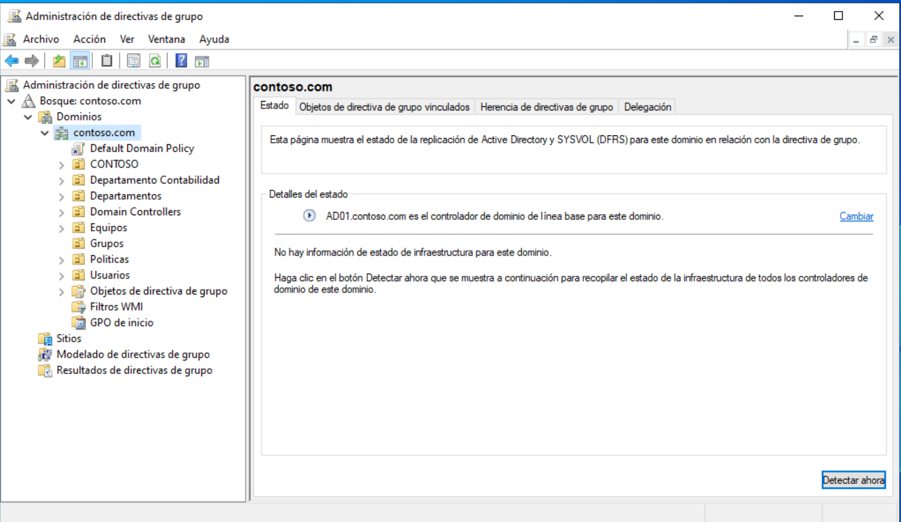
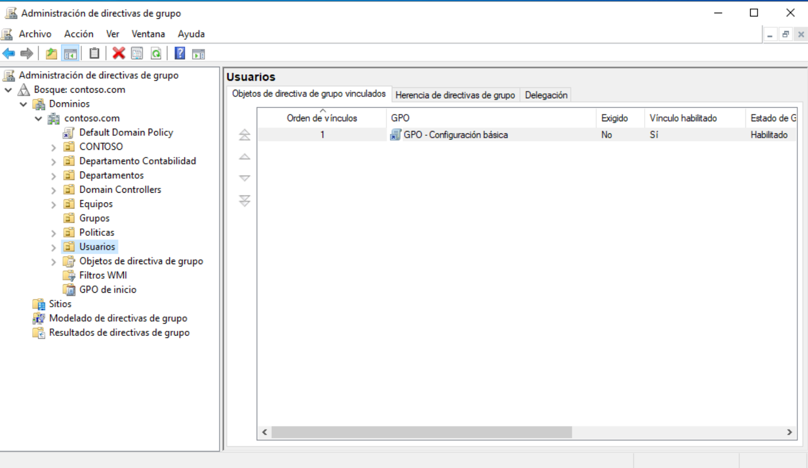
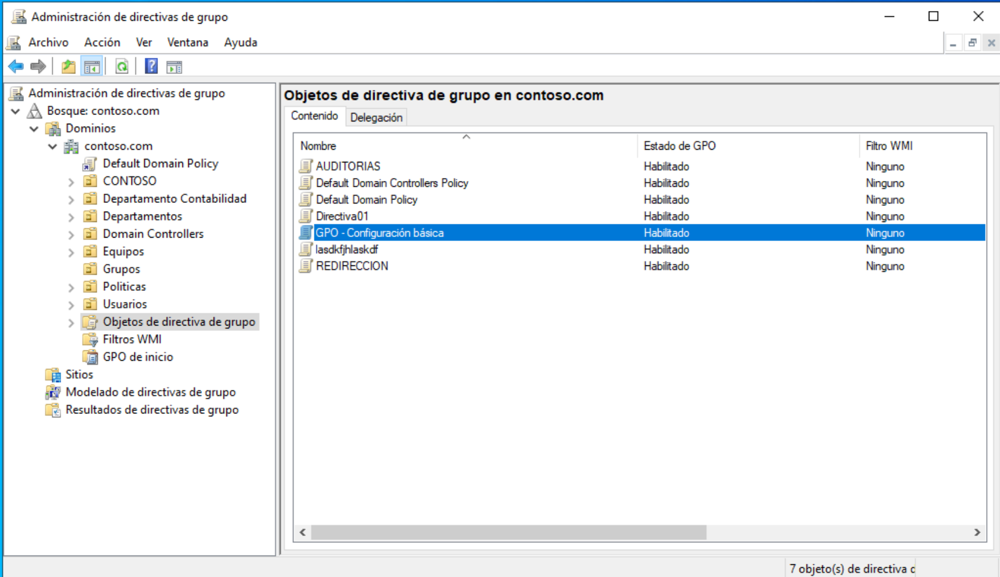
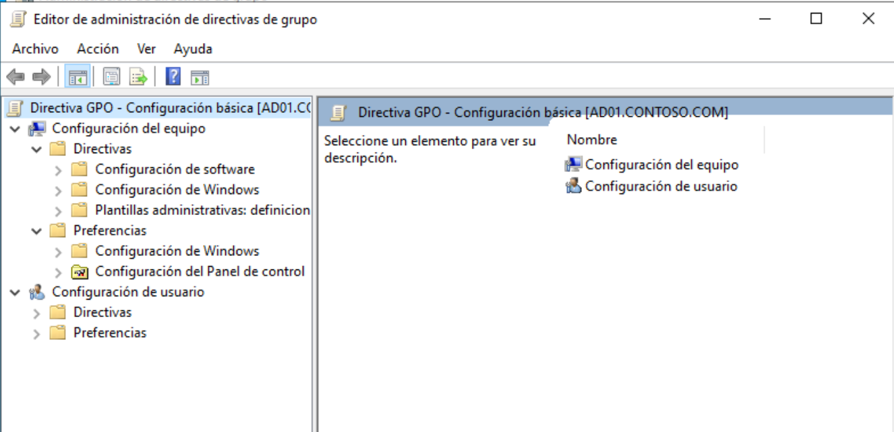
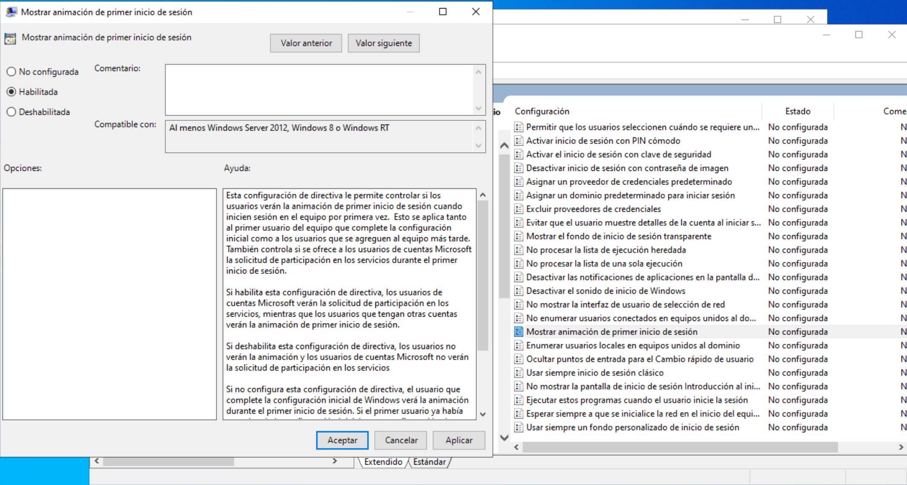
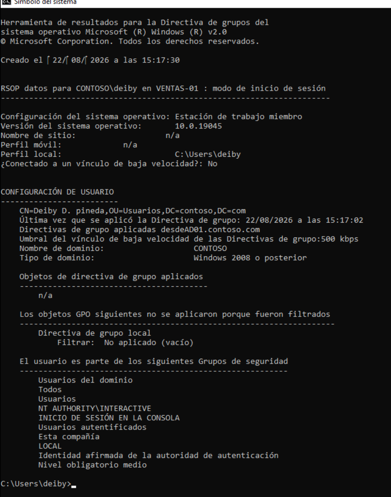

# GPOs — Directivas de grupo en contoso.com

Este apartado documenta la creación, configuración, vinculación y
verificación de las directivas de grupo (GPOs) aplicadas en el dominio
contoso.com. Todo el trabajo se realizó desde el servidor DC01
mediante la consola de Administración de directivas de grupo (GPMC)
y se validó después desde un equipo cliente con el comando
gpresult.

El objetivo de la sección es mostrar cómo se crea un GPO desde cero,
cómo se enlaza a una OU concreta, qué directivas básicas se configuran
dentro del editor y cómo se comprueba desde el lado cliente que la
directiva llega correctamente al usuario.

## Estado de la consola GPMC

Antes de crear nada conviene revisar el estado del dominio dentro de
la consola GPMC, en concreto la pestaña Estado. Esta pestaña
confirma que el DC01 tiene el rol AD01 y controla con el controlador
de dominio de línea base para este dominio, lo que garantiza que las
directivas que se creen se replicarán correctamente al resto de
controladores del dominio.

Si en esta vista apareciera un error de replicación, habría que
resolverlo antes de seguir, porque las directivas creadas durante un
problema de replicación podrían no aplicarse de forma uniforme en los
clientes del dominio.

## Objetos de directiva ya vinculados

La pestaña Objetos de directiva de grupo muestra todos los GPOs que
están vinculados al dominio contoso.com. En el momento de la captura
aparecen las directivas predeterminadas (Default Domain Policy y
Default Domain Controllers Policy), varias directivas creadas
anteriormente (AUDITORIAS, Directiva01, iaasKy5asKd, REDIRECCION) y
el GPO nuevo GPO-Configuración básica, que es el que se documenta en
esta sección.

Trabajar sobre un dominio donde ya existían GPOs previos es la mejor
forma de validar la convivencia entre directivas: si los nombres
coinciden o si dos directivas intentan configurar el mismo ajuste con
valores distintos, el comportamiento del cliente puede ser
contraproducente.

## Creación del GPO

El GPO GPO-Configuración básica se creó directamente desde la consola
GPMC haciendo clic con el botón derecho sobre el contenedor
correspondiente y seleccionando la opción para crear un nuevo objeto
de directiva de grupo vinculado a ese contenedor.

Una vez creado, el GPO queda en estado Habilitado dentro del listado
de objetos vinculados, lo que significa que la directiva se está
aplicando a todos los usuarios y equipos que pertenezcan al contenedor
donde se vinculó.

## Edición del GPO

Para editar el contenido del GPO se abrió el Editor de administración
de directivas de grupo sobre el nuevo objeto. El editor muestra la
estructura típica de cualquier GPO, con dos bloques principales:

- Configuración del equipo, que afecta a la máquina independientemente
  del usuario que inicie sesión.
- Configuración de usuario, que afecta al usuario con independencia
  de la máquina desde la que se conecte.

Cada bloque contiene a su vez las secciones Directivas (basadas en
plantillas administrativas), Preferencias y, en el caso del equipo,
Configuración de software y Configuración de Windows. La elección de
dónde aplicar cada ajuste es importante: un cambio de seguridad del
equipo debería ir en Configuración del equipo, mientras que un cambio
visual o de comportamiento del usuario debería ir en Configuración de
usuario.

## Configuración aplicada

Dentro de Configuración de usuario > Plantillas administrativas >
Escritorio, se habilitó la directiva "Mostrar animación de primer
inicio de sesión". Esta directiva controla si Windows muestra la
animación de bienvenida la primera vez que un usuario inicia sesión,
lo que permite tener un primer inicio de sesión más limpio y rápido
en equipos recién unidos al dominio.

El cuadro de ayuda de la propia ventana explica el comportamiento de
la directiva con detalle: si está habilitada, se muestra la animación;
si está deshabilitada o no configurada, no se muestra. En el
laboratorio se dejó habilitada para validar que el ajuste realmente
llegaba al cliente tras la vinculación del GPO.

## Validación con gpresult

Para confirmar que el GPO se estaba aplicando al usuario Deliby
desde el equipo VENTAS-01, se volvió a ejecutar el comando
gpresult /r desde una ventana de símbolo del sistema iniciada con las
credenciales de dicho usuario.

La salida confirma varios datos relevantes para la validación. El
usuario Deliby D. pineda pertenece a la OU Usuarios dentro de
contoso.com, y la última vez que se aplicó la directiva de grupo fue
el 22/08/2026 a las 15:17:02, aplicada desde AD01.contoso.com. En la
sección de grupos de seguridad el usuario aparece dentro de los grupos
habituales (Usuarios del dominio, Usuarios, Usuarios autentificados),
lo que confirma que la sesión se está negociando contra el DC01 sin
problemas.

El hecho de que la directiva aparezca registrada con fecha y servidor
de origen es la prueba definitiva de que el GPO se está aplicando
correctamente. Si en esta misma salida no apareciera ninguna
referencia a la directiva, habría que revisar el filtrado WMI, la
herencia de directivas o los permisos de aplicación del GPO.

## Resumen

Con los pasos descritos en esta sección queda creado, configurado,
vinculado y validado el GPO GPO-Configuración básica sobre el dominio
contoso.com. La directiva quedó aplicada al usuario Deliby en
VENTAS-01, lo que cierra el ciclo completo de gestión de directivas
de grupo: diseño, despliegue y comprobación desde el lado cliente.

