# Seguridad del servidor y del dominio

Este apartado documenta las medidas de seguridad aplicadas sobre el
controlador de dominio AD01 y sobre los equipos clientes del dominio
contoso.com. Se trabaja en tres planos: la auditoría de eventos de
inicio de sesión, la configuración del firewall de Windows con
seguridad avanzada, y las políticas locales de cuenta (complejidad,
bloqueo y validación).

El objetivo de la sección es dejar constancia de que el laboratorio
no se limita a levantar el dominio, sino que incorpora controles de
seguridad básicos que cualquier administrador de sistemas aplicaría
en un entorno real.

## Auditoría de inicio y cierre de sesión

El primer control de seguridad configurado es la auditoría de los
eventos de inicio y cierre de sesión, que es la base para poder
investigar después cualquier incidente de seguridad. Sin esta
auditoría habilitada, los registros de Windows no guardan quién
inició sesión, cuándo ni desde qué equipo, lo que deja al
administrador a ciegas ante cualquier anomalía.

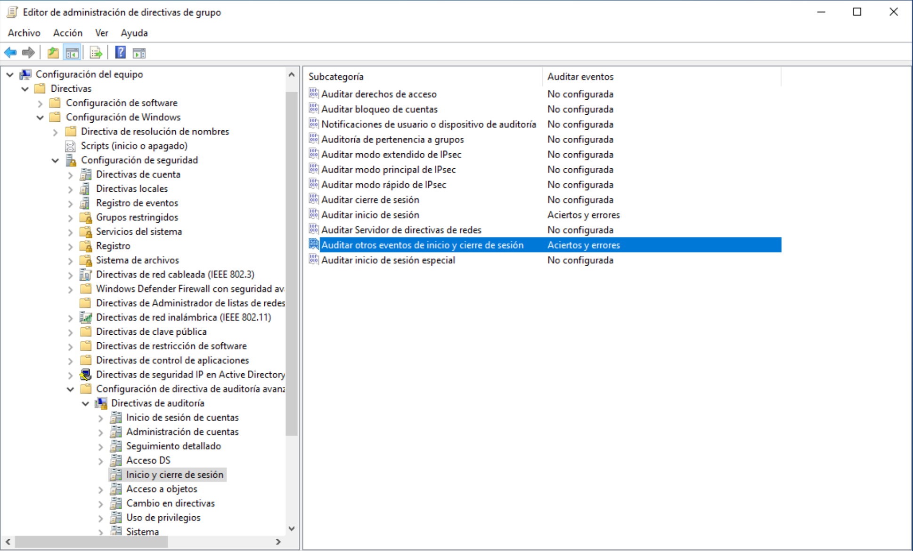

La captura anterior muestra la ruta Configuración del equipo >
Directivas > Configuración de Windows > Configuración de seguridad >
Configuración de directiva de auditoría avanzada > Directivas de
auditoría > Inicio y cierre de sesión, donde se ha habilitado la
directiva "Auditar otros eventos de inicio y cierre de sesión"
configurada para registrar tanto aciertos como errores. Esta es la
opción que más información deja en el visor de eventos, ya que
captura tanto los inicios de sesión correctos como los intentos
fallidos.

Una vez habilitada la directiva, es importante revisar qué directivas
de auditoría quedaron configuradas en la ruta clásica de Directivas
locales > Directiva de auditoría, para confirmar que el conjunto de
auditorías activas es coherente y no se contradice entre sí.

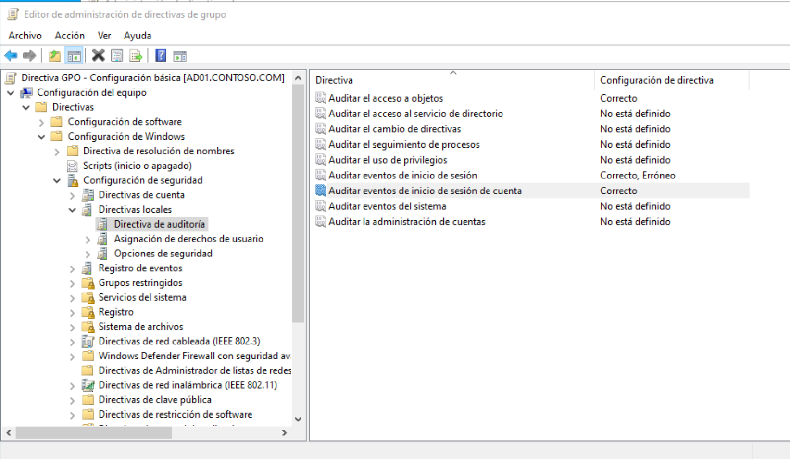

En la captura se ve que están habilitadas las directivas de auditoría
de acceso a objetos, de eventos de inicio de sesión (aciertos y
errores) y de eventos de inicio de sesión de cuenta. El resto de
directivas permanecen en "No está definido", lo que significa que
heredan el comportamiento por defecto del sistema.

## Validación en el visor de eventos

La mejor forma de confirmar que las auditorías anteriores están
funcionando es abrir el Visor de eventos y comprobar que aparecen los
eventos esperados tras una acción real, como por ejemplo un inicio de
sesión en el servidor.

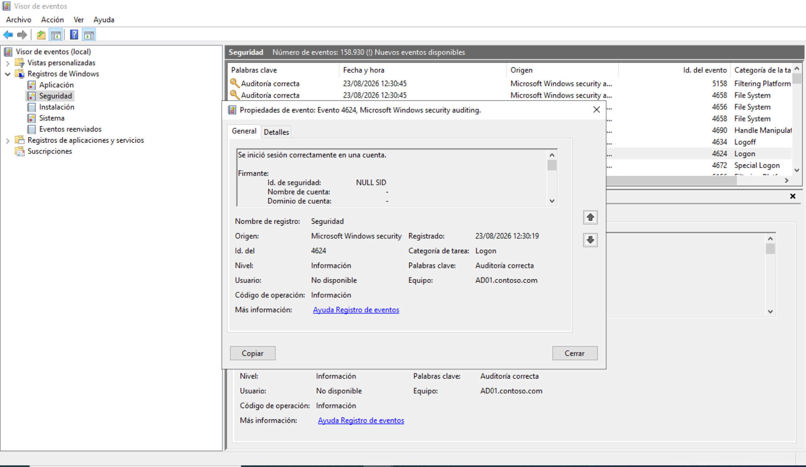

La captura muestra el evento 4624, que corresponde a un inicio de
sesión correcto. En las propiedades se puede ver el mensaje "Se
inició sesión correctamente en una cuenta", el origen
"Microsoft Windows security auditing" y el equipo AD01.contoso.com.
La fecha del registro es del 23/08/2026 a las 12:30:19, y la tarea
está clasificada como Logon.

La presencia de este evento confirma dos cosas a la vez: que la
auditoría está habilitada y que el sistema la está grabando
correctamente. Sin esta validación, cualquier configuración de
auditoría sería teórica y no se podría confiar en los registros en
caso de incidente.

## Configuración del firewall con seguridad avanzada

El siguiente control revisado es el firewall de Windows con
seguridad avanzada (WFAS). Aunque el servidor viene con un conjunto
de reglas por defecto muy completo, conviene revisar que las reglas
de entrada y salida estén activas y cubran los servicios que el
DC01 presta en el laboratorio.

### Reglas de entrada

La siguiente captura muestra la primera mitad de las reglas de
entrada. Aparecen reglas predefinidas para Active Directory Domain
Services (solicitudes y replicación), DFS, DHCP, administración
remota de servidores de archivos y centro de distribución de claves
Kerberos, entre otras.

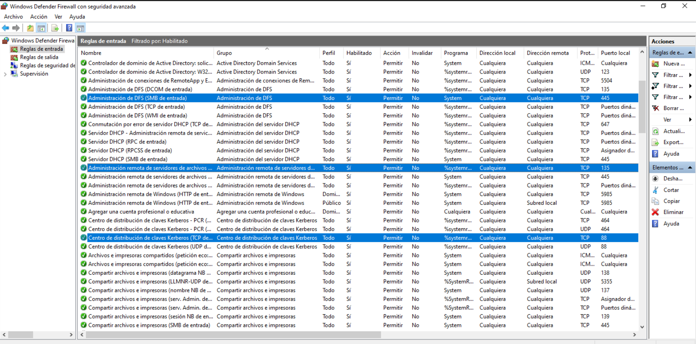

Todas estas reglas aparecen en estado Habilitado y con acción
Permitir, que es la configuración por defecto que permite al servidor
atender las peticiones de los clientes del dominio. En un entorno de
producción se aplicaría además el principio de mínimo privilegio,
deshabilitando las reglas que no se usen y restringiendo el ámbito
de las restantes a las subredes corporativas.

La segunda mitad del listado muestra reglas para DNS, escritorio
remoto, replicación DFS, servicio de agente de conexión, asignación
dinámica de DHCP y diversas reglas de infraestructura de red
principales.

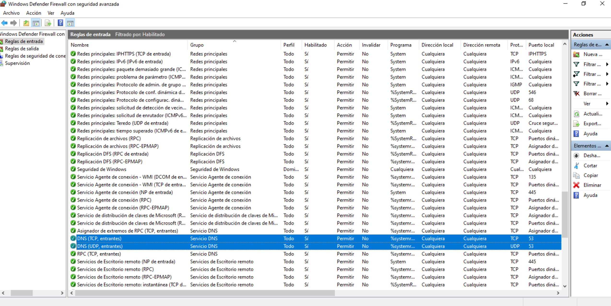

Las reglas de DNS (entrantes TCP y UDP por el puerto 53) son
especialmente críticas en un controlador de dominio, ya que el
servicio DNS es el que permite a los clientes localizar los recursos
del dominio. Si estas reglas estuvieran deshabilitadas, los
clientes no podrían resolver nombres y, en consecuencia, no podrían
ni siquiera unirse al dominio ni autenticarse correctamente.

### Reglas de salida

En el apartado de reglas de salida se aplica el mismo criterio de
revisión. Por defecto, Windows deja pasar la mayor parte del tráfico
saliente y bloquea solamente lo que esté expresamente denegado.

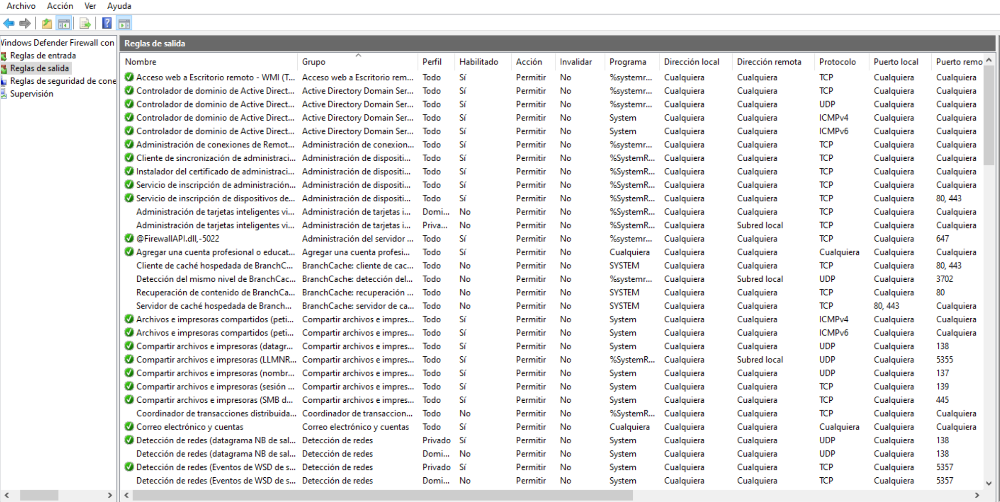

En la captura aparecen reglas para los principales servicios de
salida del servidor: DNS, Kerberos, LDAP, RPC, NTP, NetBIOS y
administración remota. Mantener estas reglas activas es necesario
para que el DC01 pueda comunicarse con otros controladores de
dominio, con clientes externos al bosque y con los servicios de
infraestructura de la red del laboratorio.

## Políticas de cuenta

El tercer bloque de medidas de seguridad corresponde a las políticas
de cuenta, que controlan la complejidad y la duración de las
contraseñas, así como el comportamiento del sistema ante intentos de
inicio de sesión fallidos. Son las primeras líneas de defensa frente
a ataques de fuerza bruta o contraseñas débiles.

### Política de contraseñas

En primer lugar se configuró la política de contraseñas dentro de
Default Domain Policy, que es la GPO que se aplica por defecto a
todas las cuentas del dominio contoso.com. Esta política define los
requisitos mínimos que debe cumplir cualquier contraseña nueva o
cambiada dentro del dominio.

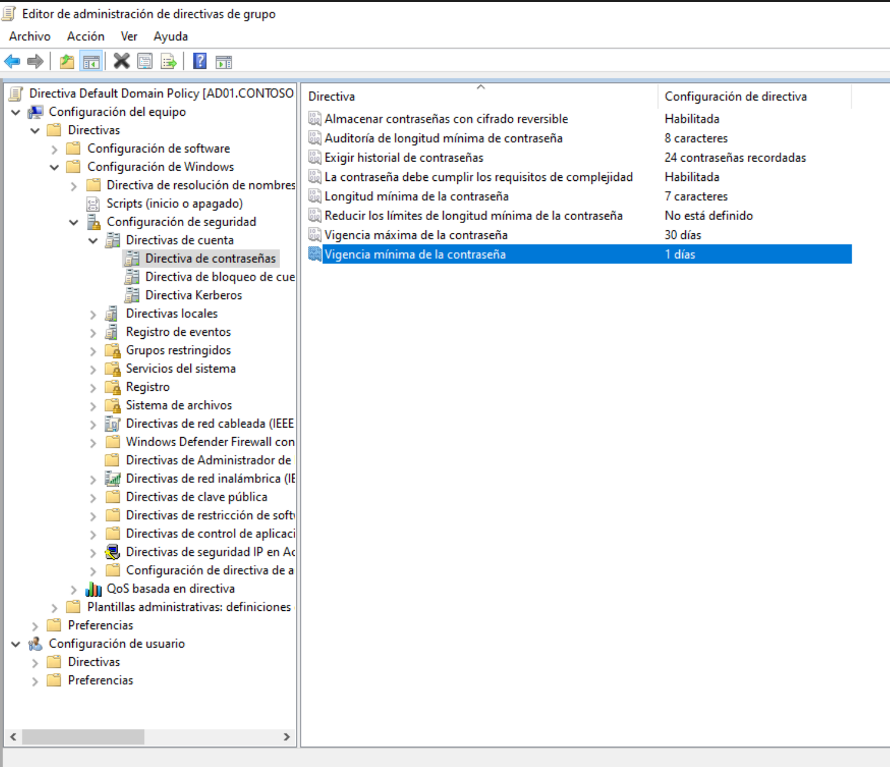

Los valores configurados en el laboratorio son los habituales de un
entorno corporativo estándar:

- Almacenar contraseñas con cifrado reversible: Habilitada (necesario
  para compatibilidad con autenticación HTTP en algunos escenarios).
- Auditoría de longitud mínima de contraseña: 8 caracteres.
- Exigir historial de contraseñas: 24 contraseñas recordadas, de
  forma que el usuario no pueda alternar entre dos o tres contraseñas
  de forma cíclica.
- La contraseña debe cumplir los requisitos de complejidad:
  Habilitada (mayúsculas, minúsculas, números y símbolos).
- Longitud mínima de la contraseña: 7 caracteres.
- Vigencia máxima de la contraseña: 30 días.
- Vigencia mínima de la contraseña: 1 día, para impedir que un
  usuario cambie la contraseña y la deje fija de forma inmediata.

Esta combinación de longitud, complejidad, historial y caducidad es
un equilibrio razonable para un laboratorio: fuerza contraseñas
robustas sin convertir el cambio de contraseña en una carga
excesiva para el usuario.

### Política de bloqueo de cuentas

Junto a la política de contraseñas se configuró la política de
bloqueo de cuentas, que define tras cuántos intentos fallidos se
bloquea una cuenta y durante cuánto tiempo permanece bloqueada.
Estas dos políticas trabajan siempre juntas: una contraseña robusta
sin bloqueo de cuenta sigue siendo vulnerable a ataques de fuerza
bruta distribuidos en el tiempo.

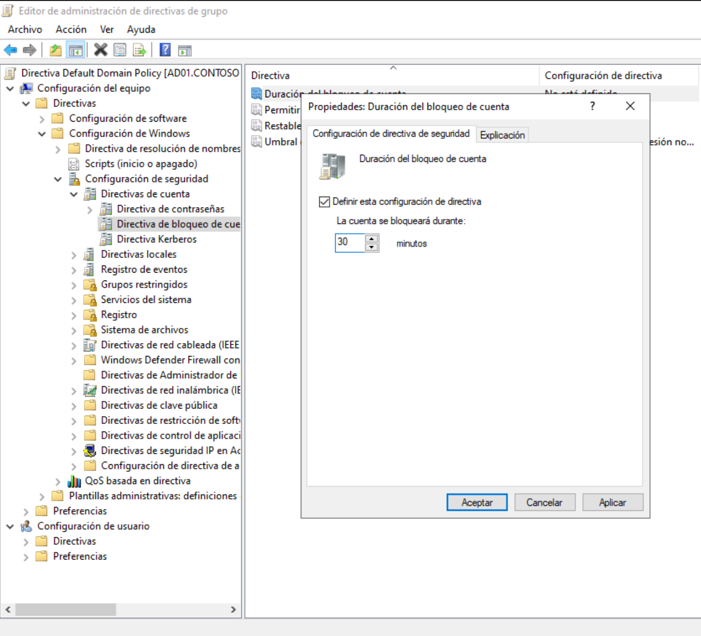

La primera directiva ajustada es la "Duración del bloqueo de
cuenta", que se fijó en 30 minutos. Esto significa que, una vez que
una cuenta supere el umbral de intentos fallidos, permanecerá
bloqueada durante media hora antes de que el contador de bloqueo se
pueda reiniciar automáticamente. Es un valor lo suficientemente
largo como para mitigar un ataque automatizado y lo suficientemente
corto como para que un usuario legítimo pueda volver a acceder sin
tener que esperar todo el día.

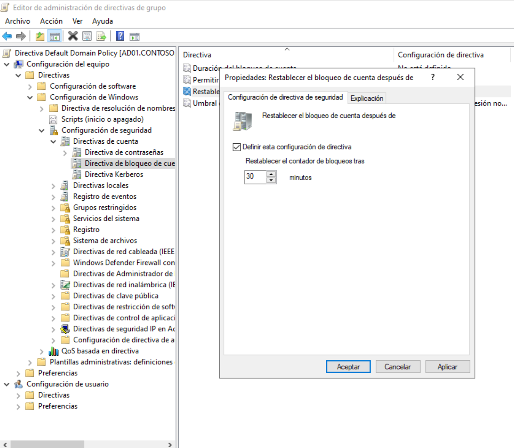

La directiva "Restablecer el bloqueo de cuenta después de" se fijó
también en 30 minutos. Esta directiva es la que controla cuándo se
pone a cero el contador de intentos fallidos, de forma que la cuenta
pueda volver a bloquearse si el atacante sigue probando contraseñas.
El hecho de que ambas directivas tengan el mismo valor es importante:
si la duración del bloqueo fuera mayor que el tiempo de
restablecimiento del contador, se podrían producir incoherencias en
el comportamiento de la política.

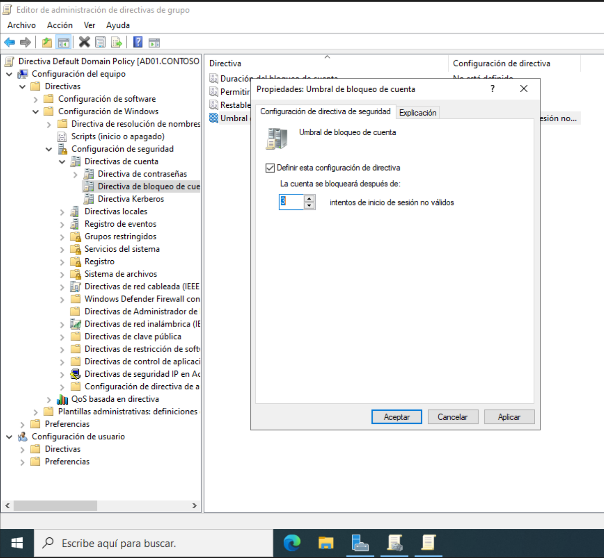

Por último, el "Umbral de bloqueo de cuenta" se fijó en 3 intentos
de inicio de sesión no válidos. Es un valor bastante conservador: a
la tercera contraseña incorrecta la cuenta se bloquea
automáticamente. En un entorno donde los usuarios tienen un único
dispositivo y normalmente recuerdan bien sus contraseñas, este valor
es suficiente para detener cualquier intento de fuerza bruta sin
provocar bloqueos accidentales por typos del usuario.

### Validación con gpresult

Una vez aplicadas las políticas, se validaron desde el propio
controlador de dominio para confirmar que las directivas definidas
en Default Domain Policy están cargándose correctamente.

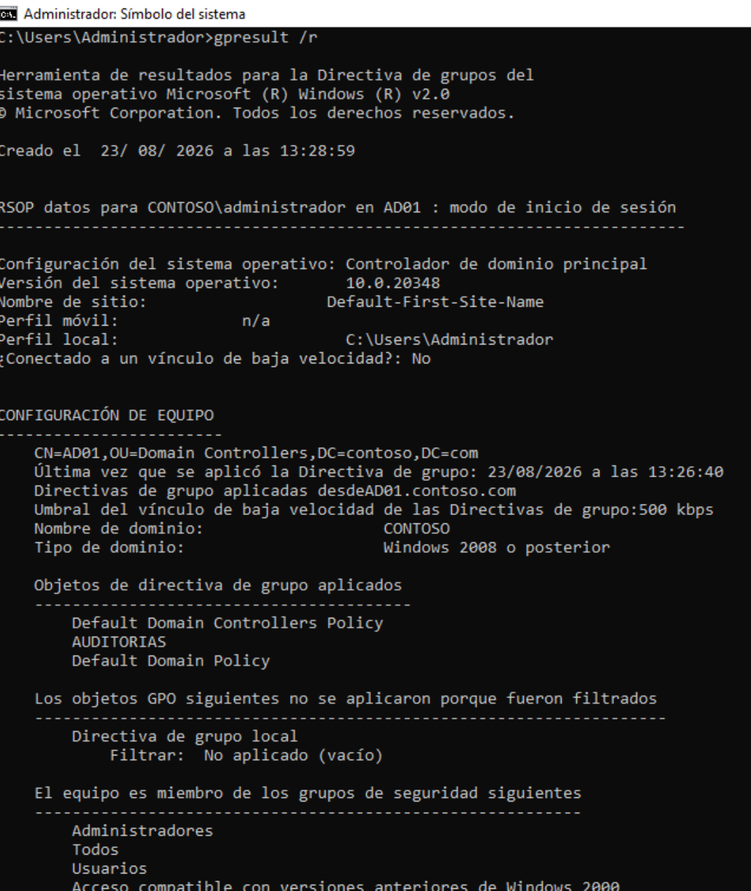

La salida del comando gpresult /r muestra que el equipo sobre el que
se ejecuta es AD01 (CN=AD01,OU=Domain Controllers,DC=contoso,DC=com)
y que las directivas de grupo aplicadas desde AD01.contoso.com son,
por este orden, Default Domain Controllers Policy, AUDITORIAS y
Default Domain Policy. La presencia de estas tres directivas,
especialmente de Default Domain Policy, es la confirmación de que
las políticas de cuenta están llegando al servidor.

El equipo aparece como miembro de los grupos Administradores,
Usuarios y Acceso compatible con versiones anteriores de Windows
2000, que son los grupos propios de un controlador de dominio. Si
las directivas no aparecieran aplicadas en esta salida, habría que
revisar la replicación de SYSVOL entre controladores de dominio o
los permisos delegados sobre el dominio.

## Resumen

Con los controles descritos en esta sección, el laboratorio cuenta con
una base mínima pero sólida de seguridad:

- Auditoría de inicio y cierre de sesión habilitada y validada en el
  visor de eventos con la aparición del evento 4624 tras un inicio
  de sesión real.
- Firewall de Windows revisado, con las reglas necesarias activas
  para los servicios del dominio, especialmente DNS y Kerberos.
- Políticas de cuenta configuradas con contraseña robusta
  (8 caracteres, complejidad, caducidad a 30 días) y bloqueo de
  cuenta tras 3 intentos fallidos durante 30 minutos, validadas
  desde el controlador de dominio mediante gpresult.

Estos controles se complementarán en próximas secciones con scripts
de automatización que apliquen de forma centralizada los mismos
ajustes a todos los equipos unidos al dominio.
