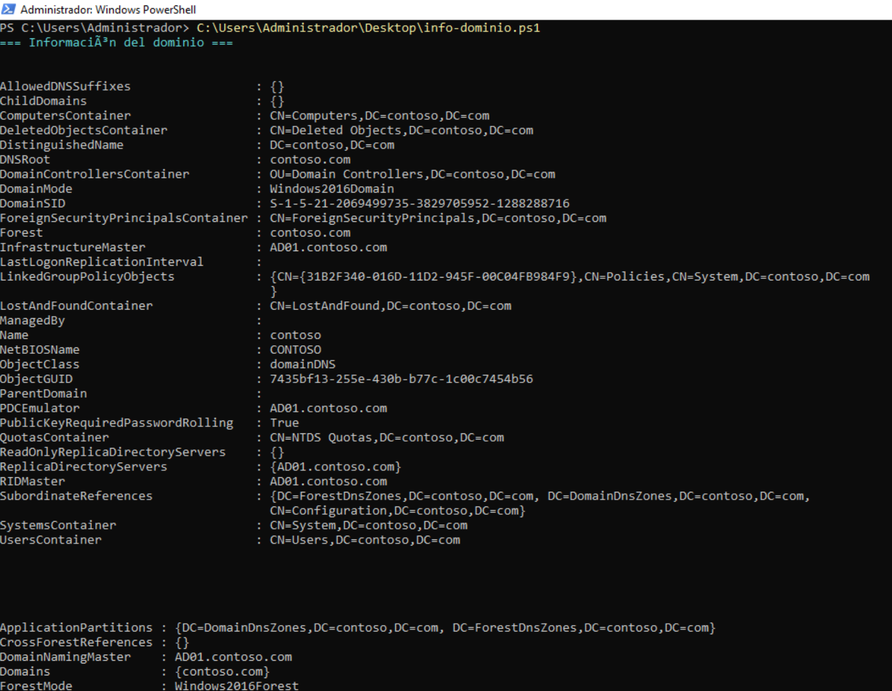
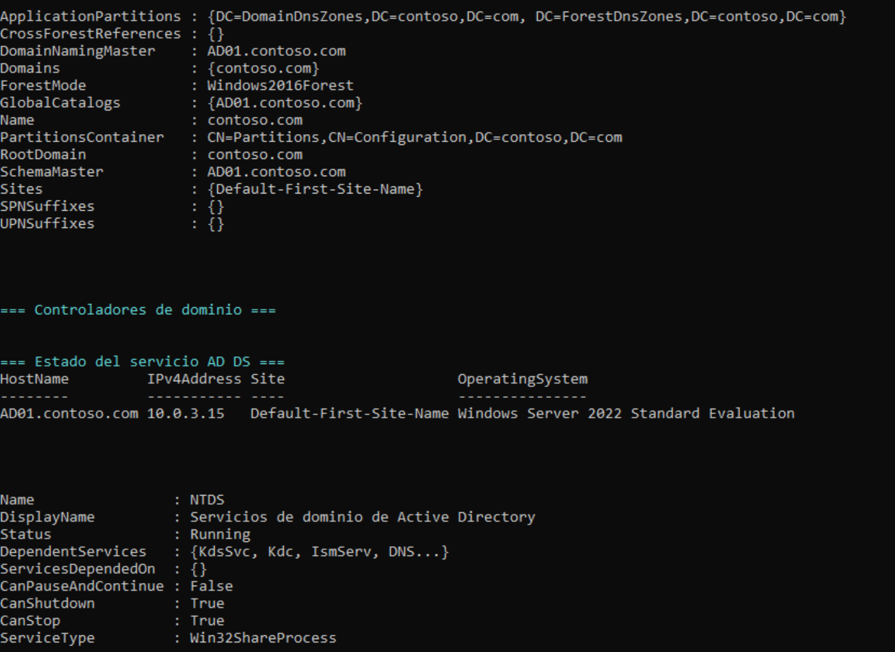
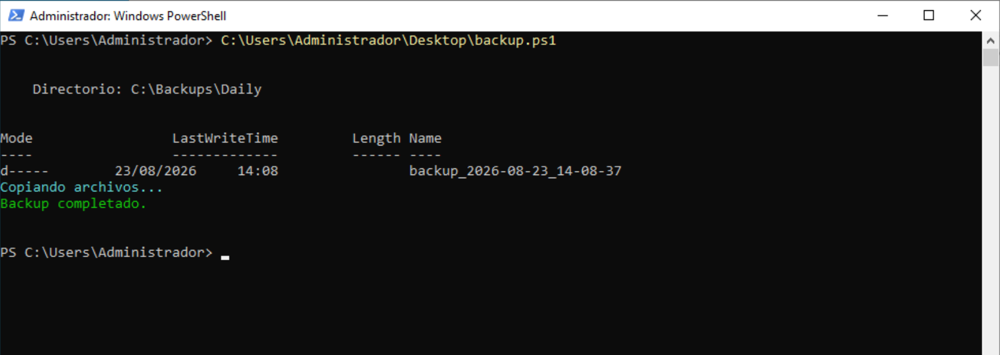
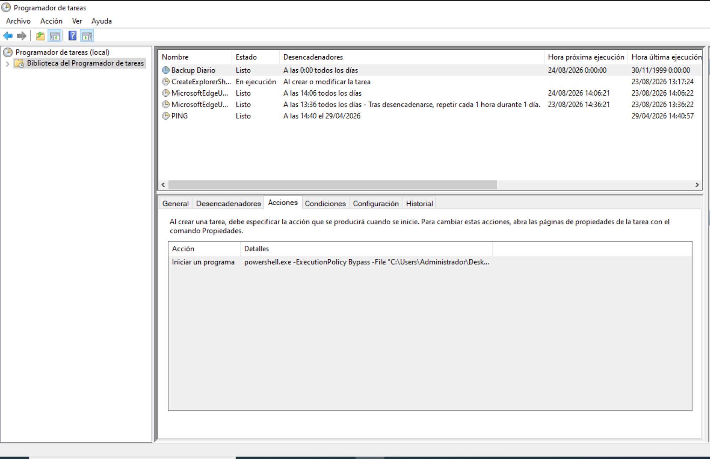

# Automatización de tareas administrativas

Este apartado documenta los scripts de PowerShell y las tareas
programadas creadas para automatizar las tareas administrativas
habituales del laboratorio: la consulta de información del dominio
Active Directory y la realización de copias de seguridad periódicas
sobre el servidor DC01.

El objetivo de la sección es mostrar cómo pasar de hacer las tareas
a mano en la consola gráfica a ejecutarlas desde un script que se
puede reutilizar, versionar y programar para que se ejecute solo,
sin intervención del administrador.

## Consulta de información del dominio con PowerShell

La primera automatización útil en cualquier controlador de dominio es
un script que permita obtener de un vistazo toda la información
relevante del dominio: nombre, nivel funcional, bosques, catálogo
global, servidores RID, maestros de operaciones y estado del
servicio AD DS.

En el laboratorio se creó el script `info-dominio.ps1`, ubicado en
el escritorio del administrador, que combina varios cmdlets del
módulo de Active Directory para sacar toda esa información en una
sola ejecución.

### Primera parte: información del dominio

La primera ejecución del script muestra la información general del
dominio, incluyendo el nombre DNS, el nombre NetBIOS, el SID del
dominio, los contenedores principales (Computers, Users, System,
LostAndFound), la lista de Domain Controllers y los servidores que
ejercen cada rol FSMO.

Entre los datos más relevantes que se pueden leer en la captura
están:

- DNSRoot: contoso.com, que confirma el dominio raíz del bosque.
- DomainMode y ForestMode: ambos en Windows2016Domain y
  Windows2016Forest respectivamente, lo que indica el nivel
  funcional del directorio.
- DomainNamingMaster, RIDMaster, PDCEmulator e InfrastructureMaster:
  todos ellos apuntan a AD01.contoso.com, confirmando que el DC01
  sigue siendo el único controlador del dominio y por tanto asume
  todos los roles FSMO.
- LinkedGroupPolicyObjects: aparecen las dos GPOs predeterminadas
  Default Domain Policy y Default Domain Controllers Policy, además
  del GPO adicional llamado Policies.
- ReplicaDirectoryServers y GlobalCatalogs: en ambos casos aparece
  únicamente AD01.contoso.com, lo que confirma que no hay todavía
  ningún controlador de dominio adicional en el bosque.

### Segunda parte: servicio AD DS

La segunda parte de la salida amplía la información con el listado de
controladores de dominio y el estado detallado del servicio NTDS
(Active Directory Domain Services).

La sección "Controladores de dominio" muestra que AD01.contoso.com
tiene la IP 10.0.3.15, pertenece al sitio Default-First-Site-Name y
está ejecutando Windows Server 2022 Standard Evaluation. Este tipo
de chequeo es muy útil para detectar de un vistazo si el
controlador está usando DHCP para su IP (en cuyo caso convendría
fijarla) o si hay varios DCs repartidos por distintos sitios.

La sección "Estado del servicio AD DS" confirma que el servicio NTDS
está Running y lista los servicios de los que depende
(KdcSvc, Kdc, IsmServ, DNS, entre otros). Si en algún chequeo
posterior el servicio apareciera con un estado distinto a Running,
ya tendríamos un foco claro por dónde empezar la investigación.

## Automatización del backup con PowerShell

La segunda automatización implementada en el laboratorio es la
realización de copias de seguridad periódicas de la información
crítica del servidor. En lugar de hacer el backup manualmente cada
vez, se creó un script de PowerShell que se encarga de generar la
carpeta con la fecha y la hora del respaldo y de copiar el contenido
a una ruta predefinida.

### Script de backup

El script `backup.ps1` está pensado para ser ejecutado de forma
automatizada por el Programador de tareas de Windows. Su
funcionamiento es sencillo: crea una carpeta con marca de tiempo en
el directorio `C:\Backups\Daily`, copia los archivos deseados dentro
y muestra por pantalla un mensaje confirmando que la operación ha
finalizado correctamente.

En la captura se ve la primera ejecución del script. La salida
muestra el listado del directorio `C:\Backups\Daily` antes de
ejecutar la copia (la carpeta está vacía salvo por la subcarpeta
`backup_2026-08-23_14-08-37` creada por una ejecución anterior),
seguido de los mensajes "Copiando archivos..." y, finalmente,
"Backup completado." en verde, que es la señal de que el script ha
terminado sin errores.

El uso del formato `backup_YYYY-MM-DD_HH-MM-SS` para nombrar la
carpeta de destino es importante: permite llevar un registro
cronológico claro de cada respaldo y facilita la rotación o el
borrado de copias antiguas sin tener que renombrar nada a mano.

### Tarea programada en el Programador de tareas

Para que el script no tenga que lanzarse a mano, se creó una tarea
programada en el Programador de tareas de Windows llamada
"Backup Diario".

La tarea se configuró con los siguientes parámetros:

- Desencadenador: diario, a las 0:00 todos los días. Esto garantiza
  que el respaldo se ejecute siempre a la misma hora, en un momento
  en el que la carga del servidor es mínima.
- Acción: iniciar el programa `powershell.exe` con los argumentos
  `-ExecutionPolicy Bypass -File "C:\Users\Administrador\Desktop
  \backup.ps1"`. El parámetro `-ExecutionPolicy Bypass` es necesario
  para que el script se ejecute aunque la política de ejecución del
  equipo esté configurada en Restricted, que es el valor por defecto
  en muchos entornos.
- Estado: Listo, lo que indica que la tarea está habilitada y
  esperando al próximo desencadenador.

En la misma ventana se puede ver que el Programador de tareas
reconoce otras tareas del sistema como MicrosoftEdgeUpdateTaskMachine
o tareas PING programadas a otras horas, lo que da una visión
general del conjunto de automatizaciones que corren sobre el
servidor.

## Resumen

Con las automatizaciones descritas en esta sección, el laboratorio
dispone de dos herramientas reutilizables que facilitan el día a día
del administrador:

- `info-dominio.ps1`, que obtiene de un solo vistazo toda la
  información relevante del dominio y del servicio AD DS, ideal
  para tareas de auditoría o diagnóstico.
- `backup.ps1` programado a las 0:00 diarias mediante el Programador
  de tareas, que automatiza la generación de respaldos con marca de
  tiempo en `C:\Backups\Daily`.

Ambas herramientas se apoyan en módulos nativos de Windows
(ActiveDirectory y Microsoft.PowerShell.Management), por lo que no
requieren instalar nada adicional en el servidor. En una evolución
natural de este apartado se podrían añadir scripts complementarios
para la creación masiva de usuarios, el monitoreo del estado de los
servicios críticos o el envío automático de informes por correo.

