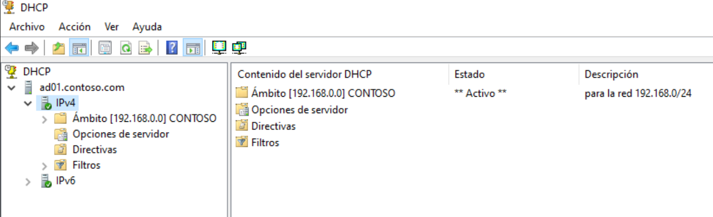
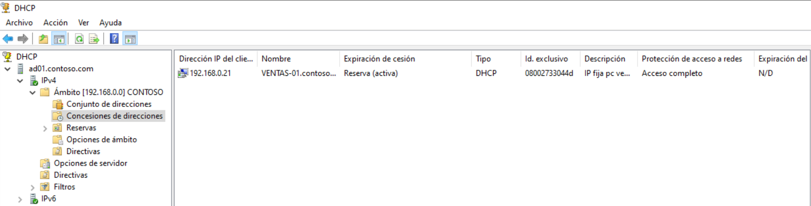
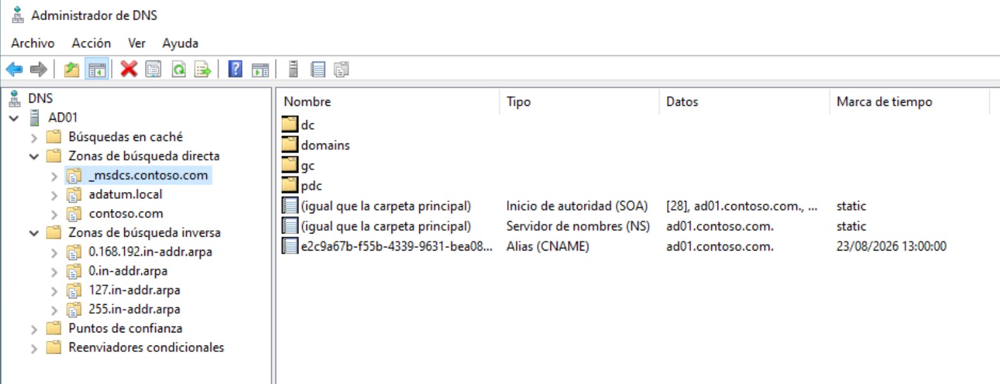
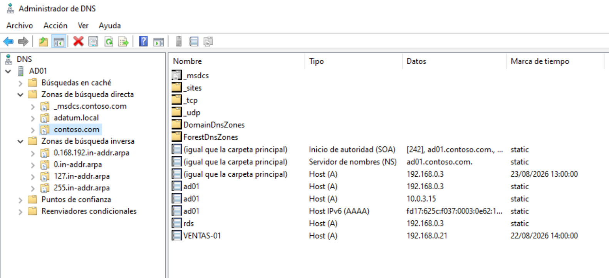
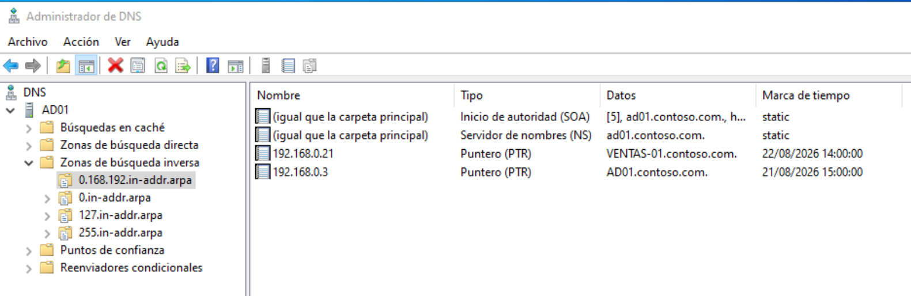
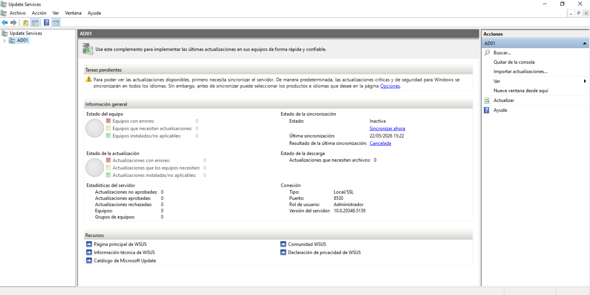
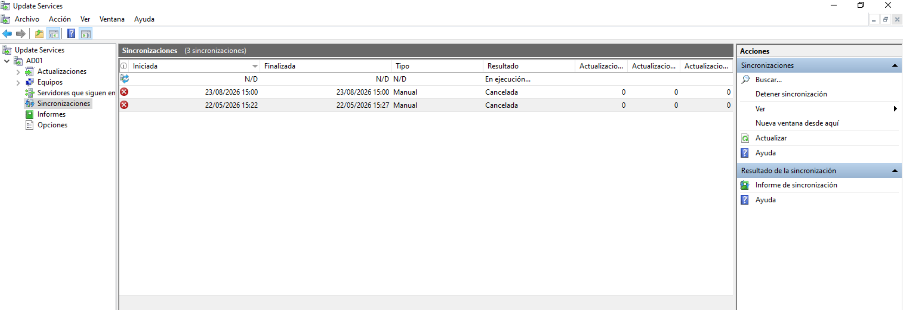

# Servicios del servidor

Este apartado documenta los tres servicios de infraestructura
levantados en el servidor DC01 que dan soporte al laboratorio:
DHCP para la asignaci&oacute;n autom&aacute;tica de direcciones IP,
DNS para la resoluci&oacute;n de nombres en el dominio contoso.com y
WSUS para la distribuci&oacute;n centralizada de actualizaciones de
Windows.

El objetivo de la secci&oacute;n es mostrar la configuraci&oacute;n
de cada servicio desde la consola gr&aacute;fica y dejar constancia
de los elementos clave: el &aacute;mbito DHCP con sus reservas, las
zonas DNS directa e inversa del dominio y el estado del servidor de
actualizaciones.

## Servicio DHCP

El servidor DHCP del laboratorio es responsable de asignar las
direcciones IP a los equipos clientes del dominio. Trabaja sobre la
red 192.168.0.0/24 y entrega direcciones en el rango configurado
para el &aacute;mbito CONTOSO, dejando fuera del reparto din&aacute;mico
las direcciones que est&aacute;n reservadas para equipos concretos.

### Estado del servidor y del &aacute;mbito

La consola DHCP muestra el servidor ad01.contoso.com con su
jerarqu&iacute;a completa: IPv4 con el &aacute;mbito CONTOSO, IPv6 y
los nodos de opciones de servidor y directivas.

El estado del &aacute;mbito aparece como "Activo", lo que significa
que el servidor est&aacute; habilitado para repartir concesiones a
los clientes que lo soliciten dentro de la red 192.168.0.0/24. Si
el &aacute;mbito estuviera en estado "Inactivo", los clientes no
podr&iacute;an obtener direcci&oacute;n IP por DHCP y habr&iacute;a que
revisar la configuraci&oacute;n antes de continuar con cualquier
otra prueba del laboratorio.

### Concesiones y reservas

Dentro del &aacute;mbito CONTOSO se observan dos elementos
importantes para la gesti&oacute;n de direcciones del laboratorio:
el conjunto de direcciones del que se nutren las concesiones
din&aacute;micas, y el listado de concesiones activas junto con las
reservas creadas a mano.

La captura muestra una reserva activa a nombre de VENTAS-01 con la
direcci&oacute;n 192.168.0.21, identificada por la direcci&oacute;n
MAC 0800273304d. La descripci&oacute;n deja claro que se trata de
una IP fija para el equipo VENTAS-01, lo que garantiza que siempre
reciba la misma direcci&oacute;n IP del servidor DHCP sin tener que
configurarla manualmente en el cliente.

En entornos donde varios equipos cr&iacute;ticos necesitan una
direcci&oacute;n estable (servidores, impresoras de red, puntos de
acceso Wi-Fi), crear reservas DHCP es preferible a configurar IPs
est&aacute;ticas: se mantiene la centralizaci&oacute;n del servicio
y se evita la fragmentaci&oacute;n de configuraciones en los equipos
clientes.

## Servicio DNS

El servicio DNS es el m&aacute;s cr&iacute;tico en un controlador de
dominio, porque de &eacute;l depende que los clientes puedan
localizar todos los recursos del bosque y autenticarse
correctamente. Por este motivo, en el laboratorio se revisan tres
vistas: la estructura general de zonas, el contenido de la zona
directa del dominio y el contenido de la zona inversa.

### Estructura de zonas

La consola del Administrador de DNS muestra la jerarqu&iacute;a de
zonas del servidor AD01 contoso.com, organizadas en dos grandes
bloques: zonas de b&uacute;squeda directa y zonas de
b&uacute;squeda inversa.

En la zona de b&uacute;squeda directa aparecen los registros del
propio servidor (_msdcs.contoso.com, contoso.com) y el dominio
adatum.local que se incluye como referencia hist&oacute;rica de la
infraestructura. En la zona de b&uacute;squeda inversa se ven las
tres subredes que el servidor conoce (0.168.192.in-addr.arpa,
0.in-addr.arpa, 127.in-addr.arpa, 255.in-addr.arpa), aunque la
&uacute;nica con registros reales en el laboratorio es la
0.168.192.in-addr.arpa.

La presencia de las subzonas predefinidas 0, 127 y 255 es normal
tras una instalaci&oacute;n est&aacute;ndar: corresponden a la red
correspondiente a la direcci&oacute;n del propio servidor y a las
direcciones de loopback, y no deben eliminarse a mano.

### Zona directa contoso.com

La zona directa contoso.com contiene los registros que permiten a
los clientes localizar los equipos y servicios del dominio por su
nombre DNS.

En la captura se ven los registros SOA y NS, que son obligatorios
en toda zona DNS, y un conjunto de registros de tipo Host (A) que
asignan nombres concretos a direcciones IP:

- ad01 resuelve a 192.168.0.3 y a 10.0.3.15, adem&aacute;s de
  contar con un registro AAAA para IPv6. Esto refleja las dos
  direcciones IP que tiene el servidor en el laboratorio (la del
  adaptador de red interna y la del adaptador NAT).
- rds resuelve a 192.168.0.3, lo que sugiere que hay un alias para
  un hipot&eacute;tico servicio de escritorio remoto ubicado en el
  mismo servidor.
- VENTAS-01 resuelve a 192.168.0.21, que coincide con la
  direcci&oacute;n fija reservada en DHCP para ese equipo,
  confirmando que DNS y DHCP est&aacute;n coordinados.

La aparici&oacute;n del registro AAAA (fd17:625c:f037:0003:0e62:1...)
indica que el servidor tambi&eacute;n est&aacute; publicando
resoluci&oacute;n IPv6. En un entorno donde solo se trabaja con IPv4
se podr&iacute;a deshabilitar para simplificar la administraci&oacute;n,
pero tenerlo activo no causa ning&uacute;n problema.

### Zona inversa 0.168.192.in-addr.arpa

La zona inversa contiene los registros PTR que realizan la
operaci&oacute;n contraria a la zona directa: traducen una
direcci&oacute;n IP en su nombre DNS. Aunque muchos servicios
funcionan sin ella, tener la resoluci&oacute;n PTR es importante
para que ciertos mecanismos de seguridad y de autenticaci&oacute;n
funcionen correctamente.

La captura muestra los registros SOA y NS y dos registros PTR:

- 192.168.0.3 apunta a AD01.contoso.com.
- 192.168.0.21 apunta a VENTAS-01.contoso.com.

Estos dos registros coinciden exactamente con los registros Host
(A) de la zona directa para los mismos equipos, lo que confirma
que la resoluci&oacute;n inversa est&aacute; bien configurada. La
marca de tiempo 21/08/2026 15:00:00 para AD01 y 22/08/2026
14:00:00 para VENTAS-01 indica cu&aacute;ndo se actualizaron por
&uacute;ltima vez, lo que sirve para detectar registros obsoletos
que est&eacute;n apuntando a equipos que ya no existen.

## Servicio WSUS

El tercer servicio configurado en el servidor es Windows Server
Update Services (WSUS), que permite descargar las actualizaciones
de Microsoft de forma centralizada y aprobarlas antes de que los
equipos clientes las instalen. Es especialmente &uacute;til en
entornos con conexiones a Internet lentas, porque evita que cada
equipo se descargue las mismas actualizaciones por separado.

### Panel general de WSUS

Al abrir la consola de Update Services sobre el servidor AD01, lo
primero que aparece es un panel con el estado general del servidor
y un aviso de tareas pendientes.

Los elementos clave del panel son:

- Estado de la sincronizaci&oacute;n: Inactiva. Esto significa que
  el servidor WSUS no se ha sincronizado autom&aacute;ticamente
  desde Microsoft Update en las &uacute;ltimas horas. La
  &uacute;ltima sincronizaci&oacute;n fue el 22/05/2026 a las 15:22
  y fue cancelada.
- Estad&iacute;sticas del servidor: aparecen todos los contadores a
  0 (equipos, equipos con errores, actualizaciones aprobadas,
  rechazadas, etc.), lo que confirma que el servidor est&aacute;
  reci&eacute;n configurado y todav&iacute;a no ha recibido ni
  aprobado actualizaciones.
- Conexi&oacute;n: indica el tipo de conexi&oacute;n Local/SSL y el
  puerto 8530, que es el puerto por defecto del servicio WSUS.

El aviso de "Tareas pendientes" en la parte superior recuerda que,
antes de aprobar actualizaciones para los clientes, es necesario
ejecutar al menos una sincronizaci&oacute;n completa del servidor.

### Sincronizaciones del servidor

Para revisar el historial de sincronizaciones se accede al nodo
Sincronizaciones dentro de la consola, donde se listan las tres
&uacute;ltimas ejecuciones.

El historial muestra tres sincronizaciones: una iniciada pero sin
finalizar, y dos canceladas manualmente. Esto es coherente con un
servidor reci&eacute;n instalado: las primeras pruebas se
interrumpieron para ajustar la configuraci&oacute;n antes de lanzar
una sincronizaci&oacute;n real de actualizaciones. Una vez ajustados
los productos e idiomas deseados, se deber&iacute;a lanzar una
sincronizaci&oacute;n completa y esperar a que termine para
empezar a aprobar actualizaciones para los equipos del dominio.

## Resumen

Con los tres servicios descritos en esta secci&oacute;n, el
laboratorio dispone de la infraestructura de red b&aacute;sica para
que los equipos del dominio puedan obtener direcci&oacute;n IP
autom&aacute;ticamente, resolver nombres directos e inversos, y
mantener sus actualizaciones al d&iacute;a de forma controlada
desde el servidor:

- DHCP reparte direcciones dentro del &aacute;mbito CONTOSO y
  garantiza direcciones estables mediante reservas como la de
  VENTAS-01.
- DNS publica los registros del dominio contoso.com tanto en
  resoluci&oacute;n directa como inversa, manteniendo AD01 y los
  equipos cr&iacute;ticos siempre localizables.
- WSUS est&aacute; listo para empezar a sincronizar con Microsoft
  Update y aprobar actualizaciones para los equipos unidos al
  dominio.

Los servicios aqu&iacute; documentados se apoyan directamente sobre
la base creada en secciones anteriores (Active Directory, GPOs y
pol&iacute;ticas de seguridad) y ser&aacute;n necesarios para las
siguientes fases del laboratorio (monitorizaci&oacute;n y
documentaci&oacute;n final).

