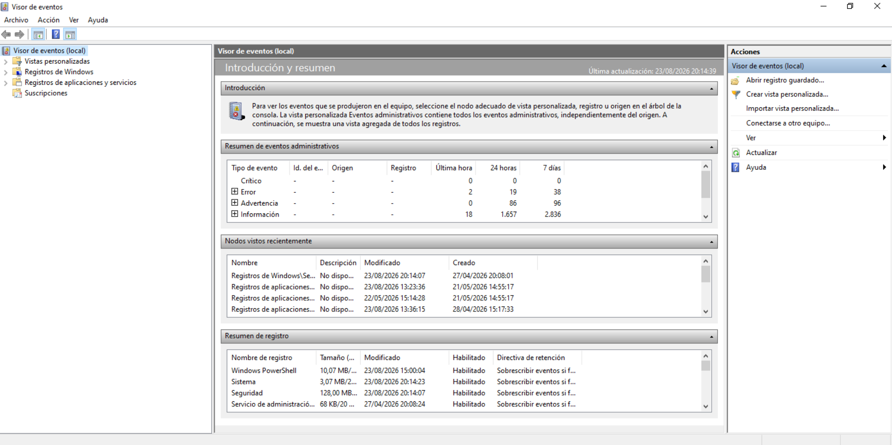
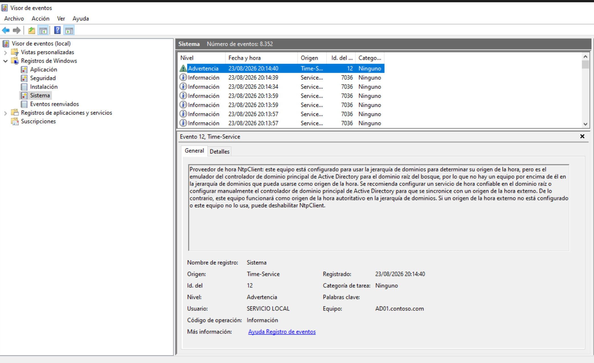
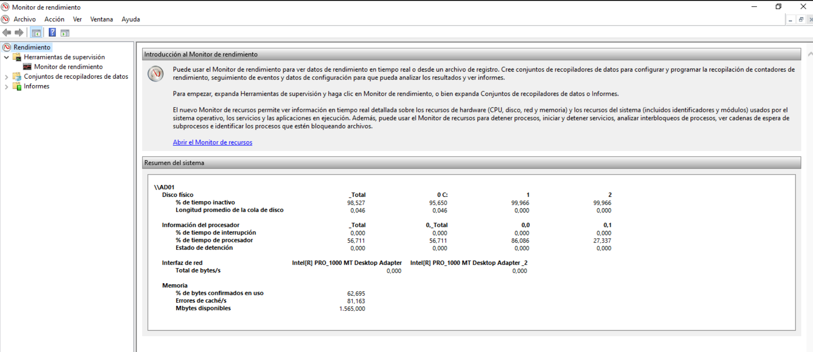
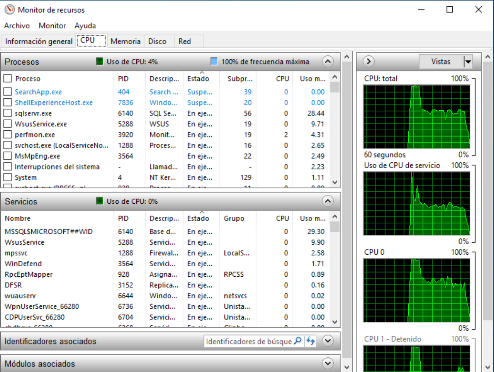
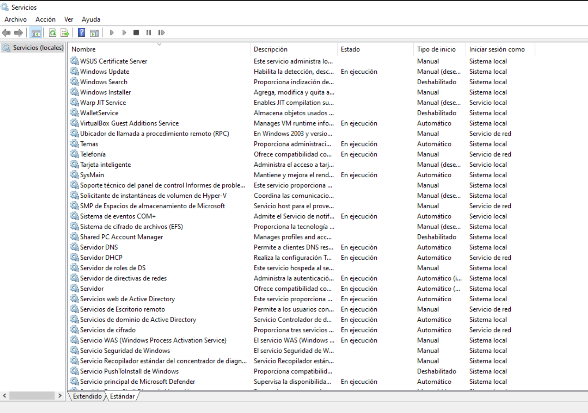

# Monitorizaci&oacute;n del servidor

Este apartado documenta las herramientas de supervisi&oacute;n
utilizadas sobre el controlador de dominio DC01 para revisar el
estado del sistema, detectar incidencias y validar que los
servicios est&aacute;n funcionando correctamente. Se trabaja con
cuatro perspectivas complementarias:

- El Visor de eventos, para revisar los registros del sistema y
  detectar avisos o errores.
- El Monitor de rendimiento, para obtener una vista agregada del
  uso de CPU, disco, red y memoria.
- El Monitor de recursos, para ver en tiempo real qu&eacute;
  procesos y servicios est&aacute;n consumiendo m&aacute;s CPU.
- La consola de Servicios, para confirmar el estado individual de
  cada servicio del servidor.

El objetivo de la secci&oacute;n es mostrar c&oacute;mo se monta un
flujo b&aacute;sico de monitorizaci&oacute;n sobre un servidor
Windows, que es lo m&iacute;nimo que cualquier administrador deber&iacute;a
revisar peri&oacute;dicamente.

## Visor de eventos

El Visor de eventos es la primera herramienta a la que se acude
cuando algo va mal en el servidor. Permite revisar los registros
del sistema, las aplicaciones y la seguridad, y detectar
incidencias que de otra forma pasar&iacute;an desapercibidas.

### Resumen del sistema

La pantalla de Introducci&oacute;n y resumen del Visor de eventos
ofrece una vista agregada de los &uacute;ltimos eventos generados
por el equipo, clasificados por tipo (Cr&iacute;tico, Error,
Advertencia, Informaci&oacute;n) y por franja temporal (&uacute;ltima
hora, 24 horas, 7 d&iacute;as).

En la captura se observa que el servidor se mantiene estable: no
hay eventos cr&iacute;ticos ni errores en ninguno de los tres rangos
temporales. En las &uacute;ltimas 24 horas se han registrado 86
advertencias y 1.657 eventos de informaci&oacute;n, lo que es
absolutamente normal para un controlador de dominio en
funcionamiento.

La parte inferior de la pantalla muestra tambi&eacute;n el resumen
de los registros disponibles (Windows PowerShell de 10 MB, Sistema
con 3 MB, Seguridad con 128 MB, etc.) y permite identificar
r&aacute;pidamente si alg&uacute;n registro est&aacute; creciendo
m&aacute;s de lo esperado, lo que ser&iacute;a un primer s&iacute;ntoma
de un problema subyacente.

### Eventos del sistema

Para profundizar en el an&aacute;lisis se abre el registro Sistema,
que es donde el sistema operativo y los servicios principales
dejan sus mensajes. En la captura se ve el listado de eventos m&aacute;s
recientes (todos del 23/08/2026 entre las 20:13:57 y las 20:14:40)
y, debajo, el detalle de uno concreto.

El evento seleccionado es el 12, de origen Time-Service, clasificado
como Advertencia. El mensaje explica que el cliente NTP (NtpClient)
est&aacute; configurado para usar la jerarqu&iacute;a de dominios
como origen de la hora, pero al ser este equipo un controlador de
dominio principal (PDC Emulator), no hay nadie por encima de &eacute;l
en esa jerarqu&iacute;a de dominios. La advertencia sugiere
configurar un servicio de hora externo para mantener la hora del
bosque sincronizada.

Este tipo de aviso, aunque aparece como Advertencia y no como
Error, hay que tenerlo en cuenta: en un controlador de dominio la
hora debe estar bien sincronizada porque Kerberos la utiliza para
validar los tickets de autenticaci&oacute;n. Una deriva de varios
minutos puede provocar fallos de autenticaci&oacute;n en los
clientes del dominio.

## Monitor de rendimiento

El Monitor de rendimiento (perfmon) es la herramienta indicada
cuando se necesita una vista hist&oacute;rica y agregada del
comportamiento del sistema. Permite crear conjuntos de
recopiladores de datos que registran contadores a lo largo del
tiempo, lo que es muy &uacute;til para detectar problemas
peri&oacute;dicos que no aparecen en revisiones puntuales.

La vista de Monitor de rendimiento sobre el servidor AD01 muestra
los principales contadores del sistema para los dos discos f&iacute;sicos
y los dos adaptadores de red.

Los datos m&aacute;s relevantes que se leen en el resumen son:

- Disco f&iacute;sico: el porcentaje de tiempo inactivo se sit&uacute;a
  entre el 98,5% y el 99,9% seg&uacute;n el disco, y la longitud
  promedio de la cola de disco es muy baja (0,046). Esto indica
  que el almacenamiento no es un cuello de botella en el servidor.
- Procesador: el porcentaje de tiempo de interrupci&oacute;n es
  pr&aacute;cticamente cero, y el porcentaje de tiempo de
  procesador est&aacute; repartido entre los n&uacute;cleos. El
  estado de detenci&oacute;n (cuando un n&uacute;cleo est&aacute;
  parado) es cero, lo que confirma que la CPU tiene margen de
  sobra.
- Interfaz de red: ambos adaptadores (Intel PRO/1000 MT Desktop
  Adapter y la versi&oacute;n con sufijo _2) muestran un total de
  bytes/s a 0, coherente con el momento de la captura en el que no
  hab&iacute;a tr&aacute;fico de red significativo.
- Memoria: el porcentaje de bytes confirmados en uso es del
  62,6%, con 1.565 MB disponibles y un 81% de errores de cach&eacute;
  por segundo, todos valores dentro de lo normal.

Si alguno de estos contadores saltara de forma sostenida,
ser&iacute;a conveniente abrir el Monitor de recursos para localizar
el proceso o servicio responsable.

## Monitor de recursos

El Monitor de recursos (resmon) es el complemento en tiempo real
del Monitor de rendimiento. Mientras que perfmon ofrece datos
agregados e hist&oacute;ricos, resmon permite ver en cada momento
qu&eacute; procesos y servicios est&aacute;n consumiendo CPU,
memoria, disco y red, y detener o investigar los que est&eacute;n
causando problemas.

En la captura, con la vista de CPU al 4% de uso total, se ve que
los procesos que m&aacute;s CPU est&aacute;n consumiendo en ese
momento son:

- sqlservr.exe: 28,44% (motor de base de datos SQL Server, que se
  ejecuta como parte del rol WSUS para almacenar el cat&aacute;logo
  de actualizaciones).
- WsusService.exe: 9,71% (servicio principal de WSUS, que gestiona
  las sincronizaciones y aprobaciones de actualizaciones).
- perfmon.exe: 4,31% (el propio proceso del Monitor de rendimiento,
  que estaba recopilando datos en ese instante).
- svchost.exe: 2,65% (varios servicios de Windows ejecut&aacute;ndose
  dentro del mismo proceso).
- MsMpEng.exe: 2,49% (el servicio antimalware Windows Defender,
  que est&aacute; haciendo su an&aacute;lisis habitual).

En la parte derecha se ve el gr&aacute;fico de uso de CPU con los
dos n&uacute;cleos del servidor: CPU 0 trabajando con utilizaciones
bajas p&eacute;ro sostenidas, y CPU 1 pr&aacute;cticamente en
reposo. Esto confirma que el servidor tiene capacidad de sobra para
los servicios que tiene levantados.

## Consola de Servicios

Por &uacute;ltimo, la consola de Servicios locales permite
verificar de un vistazo el estado individual de cada servicio del
servidor. Esta revisi&oacute;n es especialmente importante despu&eacute;s
de tareas de mantenimiento o de cambios importantes, para confirmar
que todos los servicios cr&iacute;ticos han vuelto a su estado
"En ejecuci&oacute;n".

En el listado se confirma que servicios como Servidor DNS,
Servidor DHCP, Servicios de dominio de Active Directory, Sistema
de eventos COM+, Windows Update, WSUS Certificate Server y
Servicios web de Active Directory est&aacute;n todos en estado
En ejecuci&oacute;n. Tambi&eacute;n se observa que algunos
servicios que no son necesarios para la operaci&oacute;n del
servidor est&aacute;n Deshabilitados (Windows Search, WalletService,
Shared PC Account Manager, Servicio PushToInstall de Windows), lo
que reduce la superficie de ataque del servidor.

El tipo de inicio de cada servicio tambi&eacute;n es informativo:
los servicios cr&iacute;ticos (Servidor DNS, Servicios de dominio
de Active Directory, WsusService) est&aacute;n en Autom&aacute;tico
para arrancar con el sistema, mientras que los servicios auxiliares
o administrativos (WSUS Certificate Server, Servicio WAS) est&aacute;n
en Manual, lo que es coherente con un servidor bien configurado.

## Resumen

Con las cuatro herramientas descritas en esta secci&oacute;n, el
laboratorio dispone de un flujo de monitorizaci&oacute;n b&aacute;sico
pero completo:

- Visor de eventos para detectar y analizar avisos y errores del
  sistema, como la advertencia de NtpClient que apareci&oacute;
  durante la revisi&oacute;n.
- Monitor de rendimiento para registrar tendencias de CPU, disco,
  red y memoria a lo largo del tiempo.
- Monitor de recursos para localizar en tiempo real los procesos y
  servicios que consumen m&aacute;s recursos.
- Consola de Servicios para confirmar el estado individual de cada
  servicio y validar que los servicios cr&iacute;ticos siguen
  operativos.

Estas herramientas se complementan con el panel de Administrador
del servidor visto en secciones anteriores, que ofrece una vista
agregada del estado de los roles del DC01. En conjunto cierran el
ciclo de monitorizaci&oacute;n: detecci&oacute;n, an&aacute;lisis
y actuaci&oacute;n sobre cualquier incidencia que aparezca en el
servidor.

